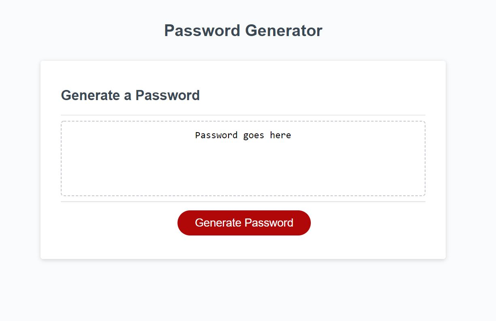

# Password-Generator-Practice

[Deployed Link](https://renbryant.github.io/Password-Generator-Practice/)

This is a password generator that was created to practice Javascript. I was given a starter code and told to make the Javascript
work so that a random password will be given at the push of a button.

FIrst I added the function to generate the password, made sure the button works, and that the characters will display on the screen.
